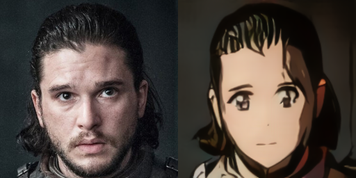
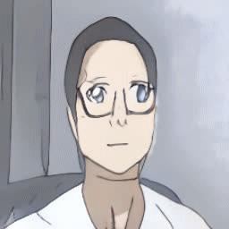

# video2anime
Turn your videos (and selfies) into anime!

## Introduction
This repository uses a [generative adversarial network](https://en.wikipedia.org/wiki/Generative_adversarial_network) to transform real-life videos and images into anime. It is based on the paper [[1]](#references) and the official implementation [[2]](#references), which contain a lot more stuff. I suppose most people are more interested in trying out the anime generation demo, so I made the following adaptations:
- simplify code to have anime generator only
- shrink original pretrained checkpoint from 8GB to 1GB
- add UI code to transform live webcam feed and individual photos more easily

## Example Results
#### Photos / Selfies

#### Videos
 

Guy vs. Girl Video Results

_Note: training data was biased, containing only images of women, which might explain why things could get weird for guys close-up_ :laughing:

## Try It Yourself
1. Install the following requirements. I have tested with these exact versions, although earlier versions might also work.
    - Ubuntu 18.04
    - Python 3.6
    - OpenCV 4.1 Python binding
    - TensorFlow 1.14 (GPU or CPU only)
    - CUDA 10.0 (for GPU support)
    - CUDNN 7.6.1 (for GPU support)
2. Clone this repository.
3. Download the pretrained checkpoint files, and put them in the directory: video2anime/checkpoints/

Checkpoint | Description | Link | Size
--- | --- | --- | ---
UGATIT_100_epoch_generator_only | Minified, generator only checkpoint based on 100-epoch checkpoint from [2] | [Google Drive](https://drive.google.com/drive/folders/1hrEAey_mUNwKpxrohF7gOXxWrFWygeIp?usp=sharing) | 1 GB

4. Run the following scripts. For best results, input images and videos should be square, and contain a big face in the center.

Script | Description | Run (with help for options)
--- | --- | --- 
record.py | Record your video to anime live with a webcam* | `python record.py --help`
selfie.py | Turn your selfie into an anime character | `python selfie.py --help`

*_Note: powerful computer with NVIDIA GPU may be required_

## References
This project is based on the paper [1] and official TensorFlow implementation by the authors [2].

[1] Junho Kim, Minjae Kim, Hyeonwoo Kang, et al. “U-GAT-IT: Unsupervised Generative Attentional Networks with Adaptive Layer-Instance Normalization for Image-to-Image Translation”. In: arXiv preprint arXiv:1907.10830 (2019).

[2] [https://github.com/taki0112/UGATIT](https://github.com/taki0112/UGATIT)
